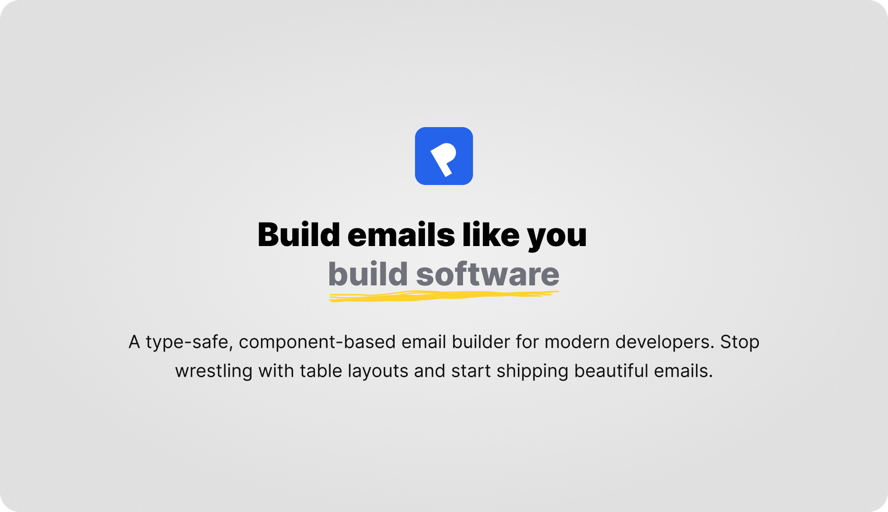

**The bridge between visual email building and high-performance React code.**

`@pagenflow/email` is a collection of high-quality, pre-tested React components designed to build beautiful, responsive emails. Built for 100% compatibility with [React Email](https://react.email/), our package allows you to take designs from the [Pagenflow Visual Builder](https://email.pagenflow.com) and drop them directly into your codebase.

---

## 🚀 Why Pagenflow?

Email development shouldn't feel like it’s stuck in 1999. While `react-email` revolutionized the "code-first" approach, Pagenflow bridges the gap for teams that want both **visual speed** and **developer-grade code**.

* **Drag, Drop, and Develop:** Design visually at [email.pagenflow.com](https://email.pagenflow.com) and export clean, semantic React code.
* **React Email Compatible:** Every component in this package works seamlessly with `@react-email/render` and the React Email preview server.
* **Prop-Driven Configuration:** Instead of messy inline styles, we use a structured `config` prop to manage all styling and layout logic.

---

## 📦 Installation

```bash
npm install @pagenflow/email
# or
yarn add @pagenflow/email

```

---

## 🧩 Components Reference

Pagenflow components use a consistent `config` prop pattern to handle styling and behavior.

### Layout & Structure

* **`Html`**: The root wrapper. Accepts a `backgroundColor` prop to set the global email background.
* **`Head`**: Manages metadata, titles, and critical MSO reset styles for Outlook.
* **`Body`**: The main content area. Uses a `config` prop for global colors, font sizes, and background images.
* **`Section`**: A structural block used to group content vertically.
* **`Container`**: A centered wrapper with sophisticated layout controls including `widthType`, `gap`, and child width distributions (`equals`, `ratio`, `manual`).
* **`Row` & `Column**`: Our powerful grid system. `Row` handles horizontal spacing and alignment, while `Column` manages internal padding and vertical alignment through their respective `config` objects.

### Content & UI

* **`Heading`**: Semantic tags (`h1`-`h6`) with a `config` prop for fine-tuning padding, typography, and text-alignment.
* **`Text`**: The workhorse for paragraphs. Supports line-height, letter-spacing, and custom typography through its `config`.
* **`Image`**: Responsive images with `config` support for `maxWidth`, `borderRadius`, and clickable `href` links.
* **`Button`**: High-conversion CTA buttons with built-in VML support for Outlook. Configurable `backgroundColor`, `borderRadius`, and `padding`.
* **`Divider`**: A customizable horizontal rule with `config` for height, color, and vertical margins.
* **`Spacer`**: Fine-tuned vertical control to create exactly the right amount of breathing room.

---

## 🛠 Usage Example

Notice that all styling and layout properties are passed through the **`config`** prop.

```tsx
import { 
  Html, Head, Body, Container, Section, 
  Heading, Button, Image 
} from '@pagenflow/email';

export default function WelcomeEmail() {
  return (
    <Html backgroundColor="#f6f9fc">
      <Head title="Welcome to Pagenflow" />
      <Body config={{ color: '#333333', fontSize: '16px' }}>
        <Container config={{ 
          widthType: 'fixed', 
          width: '600px',
          childrenConstraints: { widthDistributionType: 'equals' }
        }}>
          <Section>
            <Image config={{
              src: "https://example.com/logo.png",
              alt: "Pagenflow Logo",
              width: "150px",
              padding: "20px 0"
            }} />
            
            <Heading config={{ 
              level: 'h1', 
              textAlign: 'center',
              text: 'Welcome aboard!' 
            }} />
            
            <Button config={{ 
              href: "https://email.pagenflow.com",
              backgroundColor: "#007bff",
              color: "#ffffff",
              padding: "12px 24px",
              borderRadius: "4px"
            }}>
              Get Started
            </Button>
          </Section>
        </Container>
      </Body>
    </Html>
  );
}

```

---

## 🎨 Visual Builder

Stop guessing how your padding looks. Use our **Visual Email Editor** to build your templates:

👉 **[Launch the Pagenflow Builder](https://email.pagenflow.com)**

1. Drag components onto the canvas.
2. Customize styles with the sidebar.
3. **Copy the React code** and paste it into your project using this package.

---

## 📄 License

MIT © [Pagenflow](https://email.pagenflow.com)